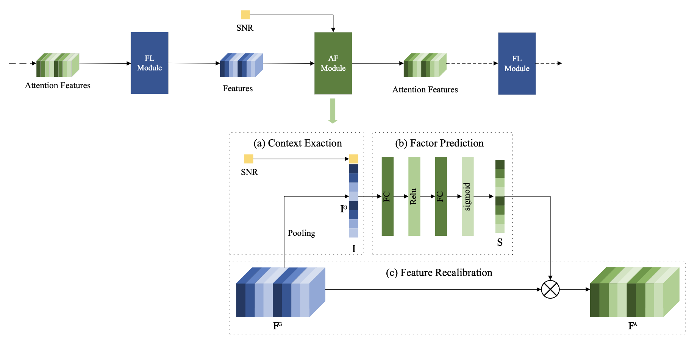

# ADJSCC

Wireless Image Transmission Using Deep Source Channel Coding with Attention Modulesの実装です。



## RaindropのGT画像による学習

### 目的

RaindropデータセットのクリーンなGT画像だけを使い、AWGN通信路のSNRが`-10 dB`から`20 dB`の間で変化してもGT画像を再構成できるADJSCCを学習します。

```text
GT画像 → ADJSCC Encoder → AWGN(-10〜20 dB) → ADJSCC Decoder → 再構成GT画像
   └─────────────── MSEの正解画像 ───────────────┘
```

`train/data`の雨滴付き画像は使いません。入力と教師はどちらも同じ`train/gt`画像です。これは雨滴除去学習ではなく、クリーン画像の通信・再構成学習です。

### 1. データセットの配置

Resfusionと同じRaindropデータセットを使います。

```text
../datasets/Raindrop/
├── train/
│   └── gt/          # 学習用GT: 861枚
└── test_a/
    └── gt/          # 検証・評価用GT: 58枚
```

`ADJSCC`ディレクトリで実行する場合、データルートは通常`../../datasets/Raindrop`です。次のコマンドで確認します。

```bash
cd ADJSCC
find ../../datasets/Raindrop/train/gt -maxdepth 1 -type f | wc -l
find ../../datasets/Raindrop/test_a/gt -maxdepth 1 -type f | wc -l
```

861と58が表示されることを確認してください。データセットを別の場所に置いた場合は、実行時の`--data_dir`を変更します。

### 2. ResfusionとADJSCCの統合環境

ADJSCCはTensorFlow/Keras、ResfusionはPyTorchの実装です。後でADJSCCの信号空間内にResfusionを接続するため、両方を同じPython processでimportできる統合conda環境を作ります。

現在のResfusion環境はPython 3.8とPyTorch 2.1.1/CUDA 12.1です。Python 3.8にTensorFlow 2.13を追加すると依存packageがダウングレードされる可能性があるため、動作中の`resfusion`環境は変更せず、Python 3.10の統合環境を新規作成します。ADJSCCが使う`SignalConv2D`と`GDN`のPython層を含むTensorFlow Compression 2.14.1に合わせ、TensorFlowも2.14系に固定します。

```bash
conda create -n resfusion-adjscc python=3.10 -y
conda activate resfusion-adjscc

conda install \
  pytorch=2.1.1 \
  torchvision=0.16.1 \
  torchaudio=2.1.1 \
  pytorch-cuda=12.1 \
  pytorch-lightning=2.1.1 \
  -c pytorch -c nvidia -c conda-forge

python -m pip install --upgrade pip setuptools wheel
python -m pip install \
  albumentations==1.3.1 \
  einops==0.7.0 \
  torchmetrics==1.2.1 \
  tensorboard matplotlib pillow opencv-python

python -m pip install \
  "tensorflow==2.14.*" \
  "tensorflow-compression==2.14.1"
```

WSL/Linuxでは、このリポジトリに同梱された`tensorflow_compression`は使いません。これはTensorFlow 2.1・macOS向けで、pip版と同じimport名を持つため、改名します。

```bash
cd /mnt/d/WSL_Work/Resfusion/ADJSCC
mv tensorflow_compression tensorflow_compression_macos_legacy
```

改名なので必要なら元に戻せます。これを行わないと、pip版をインストールしても古い同梱版が先にimportされます。

両フレームワークを同時に読み込めることを確認します。

```bash
python - <<'PY'
import torch
import tensorflow as tf
import tensorflow_compression as tfc

print("PyTorch:", torch.__version__)
print("PyTorch CUDA:", torch.version.cuda)
print("PyTorch GPU:", torch.cuda.is_available())
print("TensorFlow:", tf.__version__)
print("TensorFlow GPU:", tf.config.list_physical_devices("GPU"))
print("TensorFlow Compression:", tfc.__file__)
PY
```

TensorFlowは`2.14.x`、`tfc.__file__`は統合conda環境内の`site-packages/tensorflow_compression/...`を指すのが正常です。TensorFlowのGPU一覧が`[]`の場合、CPU実行はできますが学習は非常に遅くなります。

#### GPUメモリの共存

TensorFlowは初期化時にGPUメモリの大部分を確保することがあります。PyTorchと同時に使うentry pointでは、TensorFlowでtensorを作る前にmemory growthを有効にします。

```python
import tensorflow as tf

for gpu in tf.config.list_physical_devices("GPU"):
    tf.config.experimental.set_memory_growth(gpu, True)

import torch
```

#### 信号空間での将来の接続

TensorFlow tensorとPyTorch tensorの値はDLPackで変換できますが、TensorFlowとPyTorchの自動微分graphは別です。DLPackを使ってもフレームワークをまたいだ勾配は自動では伝わりません。

- ADJSCCを固定し、中間信号をResfusionで処理する場合: 統合環境とDLPackで実装可能
- ADJSCCとResfusionをend-to-endで同時学習する場合: ADJSCCをPyTorchへ移植し、全体を1つの自動微分graphにする方法を推奨

Resfusionの`datamodule/Raindrop.py`はPyTorchの`Dataset`を返すため、TensorFlow/KerasのADJSCCに直接渡すことはできません。次節で、画像選択と前処理を合わせたTensorFlow用アダプタを作成します。

### 3. TensorFlow用Raindropデータローダの作成

`dataset/dataset_raindrop.py`を新規作成します。学習前処理はResfusionの`datamodule/Raindrop.py`と同じ方針にします。

1. RGBでGT画像を読む
2. 長辺が1024を超える場合は長辺を1024に縮小する
3. 幅と高さをそれぞれ16の倍数に切り上げる
4. 学習時は`256×256`をランダムクロップする
5. 50%の確率で左右反転する
6. 各サンプルのSNRを`[-10, 20] dB`の連続一様分布から生成する
7. `((gt_image, snr_db), gt_image)`をKerasに返す

最小構成は次のようにします。

```python
from pathlib import Path
import tensorflow as tf

AUTOTUNE = tf.data.experimental.AUTOTUNE


def _read_and_resize(path):
    image = tf.io.read_file(path)
    image = tf.image.decode_image(image, channels=3, expand_animations=False)
    image.set_shape([None, None, 3])
    image = tf.cast(image, tf.float32)  # ADJSCC内部で255で割るため0〜255のまま使う

    height = tf.shape(image)[0]
    width = tf.shape(image)[1]
    long_side = tf.maximum(height, width)
    scale = tf.minimum(1.0, 1024.0 / tf.cast(long_side, tf.float32))
    new_height = tf.cast(tf.math.ceil(tf.cast(height, tf.float32) * scale), tf.int32)
    new_width = tf.cast(tf.math.ceil(tf.cast(width, tf.float32) * scale), tf.int32)
    new_height = 16 * tf.cast(tf.math.ceil(tf.cast(new_height, tf.float32) / 16.0), tf.int32)
    new_width = 16 * tf.cast(tf.math.ceil(tf.cast(new_width, tf.float32) / 16.0), tf.int32)
    return tf.image.resize(image, [new_height, new_width])


def _train_sample(path, snr_low, snr_high):
    image = _read_and_resize(path)
    image = tf.image.random_crop(image, [256, 256, 3])
    image = tf.image.random_flip_left_right(image)
    snr_db = tf.random.uniform([1], snr_low, snr_high, dtype=tf.float32)
    return (image, snr_db), image


def get_train_dataset(root_dir, snr_low=-10.0, snr_high=20.0):
    extensions = {".png", ".jpg", ".jpeg", ".bmp"}
    paths = sorted(
        str(p) for p in Path(root_dir, "train", "gt").iterdir()
        if p.is_file() and p.suffix.lower() in extensions
    )
    if not paths:
        raise FileNotFoundError(f"GT images were not found: {root_dir}/train/gt")
    dataset = tf.data.Dataset.from_tensor_slices(paths)
    dataset = dataset.shuffle(len(paths), reshuffle_each_iteration=True)
    dataset = dataset.map(
        lambda path: _train_sample(path, snr_low, snr_high),
        num_parallel_calls=AUTOTUNE,
    )
    return dataset, len(paths)
```

`tf.random.uniform`の上限は含まれないため、厳密には`-10 <= SNR < 20`です。20 dBを評価点として含めることには問題ありません。整数SNRだけを使う場合は`tf.random.uniform([1], -10, 21, dtype=tf.int32)`を`float32`へcastしますが、ADJSCCの適応学習では連続値を推奨します。

### 4. Raindrop用学習スクリプトの作成

`adjscc_imagenet.py`を`adjscc_raindrop.py`へコピーし、次を変更します。

```python
from dataset import dataset_raindrop
```

モデル入力はResfusionの学習パッチと同じ`256×256`にします。

```python
input_imgs = Input(shape=(256, 256, 3))
input_snrdb = Input(shape=(1,))
normal_imgs = Lambda(lambda x: x / 255.0, name="normal")(input_imgs)
encoder = Attention_Encoder(normal_imgs, input_snrdb, args.transmit_channel_num)
channel_output = Channel(channel_type="awgn")(encoder, input_snrdb)
decoder = Attention_Decoder(channel_output, input_snrdb)
output_imgs = Lambda(lambda x: x * 255.0, name="denormal")(decoder)
model = Model(inputs=[input_imgs, input_snrdb], outputs=output_imgs)
model.compile(Adam(args.learning_rate), loss="mse")
```

学習データの作成部分を次のようにします。

```python
train_ds, train_num = dataset_raindrop.get_train_dataset(
    args.data_dir,
    float(args.snr_low_train),
    float(args.snr_up_train),
)
train_ds = train_ds.batch(args.batch_size, drop_remainder=True)
train_ds = train_ds.prefetch(tf.data.experimental.AUTOTUNE)
steps_per_epoch = train_num // args.batch_size
model.fit(train_ds, epochs=args.epochs, steps_per_epoch=steps_per_epoch, callbacks=[checkpoint])
```

引数にはデータセットの場所を追加します。

```python
parser.add_argument("--data_dir", default="../../datasets/Raindrop")
parser.add_argument("--snr_low_train", default=-10.0, type=float)
parser.add_argument("--snr_up_train", default=20.0, type=float)
```

出力ディレクトリはスクリプト内で作成してから保存します。

```python
os.makedirs(args.model_dir, exist_ok=True)
os.makedirs(args.loss_dir, exist_ok=True)
```

### 5. 学習の実行

RTX A5000 24 GBでは、まず`batch_size=4`から開始します。ADJSCCは256チャネルの特徴マップを複数使用するため、`256×256`かつ大きなバッチではVRAM不足になる可能性があります。

```bash
cd ADJSCC
mkdir -p model loss eval

python adjscc_raindrop.py train \
  --data_dir ../../datasets/Raindrop \
  --channel_type awgn \
  --snr_low_train=-10 \
  --snr_up_train=20 \
  --batch_size 4 \
  --epochs 500 \
  --learning_rate 0.0001 \
  --transmit_channel_num 16 \
  --model_dir model/ \
  --loss_dir loss/
```

負の値は別のオプションと誤認されないよう、`--snr_low_train=-10`のように`=`で指定します。

学習中、各画像には`-10〜20 dB`から独立に選ばれたSNRが与えられます。1つの固定SNRで学習するのではありません。Attention Feature Moduleにも同じSNRが入力されるため、EncoderとDecoderは通信路品質に応じた特徴表現を学習します。

VRAM不足の場合は`--batch_size 2`または`--batch_size 1`へ下げます。データ読み込みがボトルネックになる場合は、`../datasets`をWSLのLinux filesystemへ置くと`/mnt/d`より高速になる場合があります。

### 6. 保存される成果物

推奨ファイル名は、実験条件が分かるように次の形式にします。

```text
model/adjscc_raindrop_awgn_tcn16_snrdb-10to20_bs4_lr0.0001.weights.h5
loss/adjscc_raindrop_awgn_tcn16_snrdb-10to20_bs4_lr0.0001.json
```

チェックポイントは`val_loss`を使う場合は検証損失が改善した時、学習データだけを使う場合は`loss`が改善した時に保存します。再開時は`--load_model_path`に`.weights.h5`を指定します。

```bash
python adjscc_raindrop.py train \
  --data_dir ../../datasets/Raindrop \
  --snr_low_train=-10 \
  --snr_up_train=20 \
  --load_model_path model/adjscc_raindrop_awgn_tcn16_snrdb-10to20_bs4_lr0.0001.weights.h5
```

### 7. SNR別の評価

評価には`test_a/gt`だけを使用し、`-10, -9, ..., 20 dB`の各点でMSEとPSNRを計算します。評価時にはランダムクロップや左右反転を適用せず、GT画像全体をResfusionと同じ規則で最大1024・16の倍数へ調整します。画像サイズが異なるため、全体画像の評価は`batch_size=1`にします。

評価用モデルは全体画像を受け取れるように`Input(shape=(None, None, 3))`で構築します。畳み込み層の重みは空間サイズに依存しないため、`256×256`で学習した重みを読み込めます。

```bash
python adjscc_raindrop.py eval \
  --data_dir ../../datasets/Raindrop \
  --channel_type awgn \
  --snr_low_eval=-10 \
  --snr_up_eval=20 \
  --batch_size 1 \
  --load_model_path model/adjscc_raindrop_awgn_tcn16_snrdb-10to20_bs4_lr0.0001.weights.h5 \
  --eval_dir eval/
```

AWGNは実行ごとに変わるため、各SNRで複数回推論し、PSNRの平均と標準偏差を記録してください。

### 8. 実行前チェック

- `train/gt`が861枚、`test_a/gt`が58枚ある
- `train/data`をデータローダへ渡していない
- 入力と教師が同じGT画像である
- 学習入力が`256×256×3`のNHWC形式である
- 画素値がモデル入力時点で`0〜255`である（モデル内で`255`除算するため）
- SNR tensorの形が各サンプルで`(1,)`、batch後に`(batch, 1)`である
- 学習SNRが連続一様分布`[-10, 20)`になっている
- 通信路が`Channel(channel_type="awgn")`になっている
- モデル、loss、評価結果の出力ディレクトリが存在する

## 元実装のデータセット

- CIFAR-10は`tensorflow.keras.datasets.cifar10`から取得します。
- ImageNetは手動で作成したTFRecordを前提としており、リポジトリには含まれません。

## 注意事項

1. 同梱された`tensorflow_compression`はmacOS向けです。Linux/WSLでは、TensorFlowと互換性のある公式`tensorflow-compression` packageを使用してください。
2. ImageNetで`bdjscc_imagenet.py`または`adjscc_imagenet.py`を使用する場合は、ImageNetの読み込み処理を環境に合わせて変更する必要があります。

## Citation

J. Xu, B. Ai, W. Chen, A. Yang, P. Sun and M. Rodrigues, "Wireless Image Transmission Using Deep Source Channel Coding With Attention Modules," in IEEE Transactions on Circuits and Systems for Video Technology, vol. 32, no. 4, pp. 2315-2328, April 2022, doi: 10.1109/TCSVT.2021.3082521.

Original contact: xjl-88410@163.com
